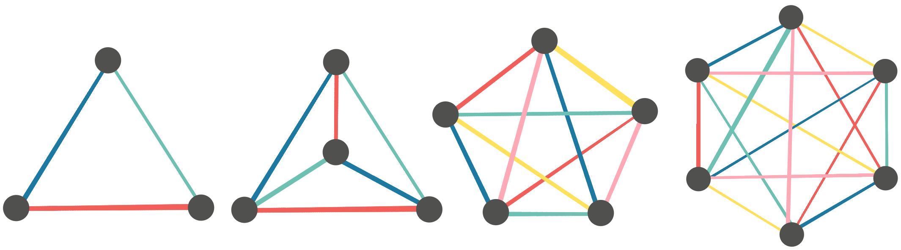

# Talking to Everybody

I teach English to Japanese primary and lower secondary students. The students
often have to do conversation activities, which involves them finding some
friends and practiving a conversation with them.

One of the teacher's ideas to help the students practice more is to set a target
number of people for the students to practice the conversation with before they
can sit down again. For example, perhaps the students are practicing the
following conversation:

- **A**: What is your best memory?
- **B**: My best memory is school trip.
- **A**: What did you see?
- **B**: We saw a dolphin show.

If the teacher sets the target at 5, then each student has to find 5 different
friends and practice the conversation with them, once as person **A** and once
as person **B** with each friend.

## The Question

One day, before the teacher annouced the target, some of the students said "全
員！" which means "everyone". The teacher dismissed this proposal as it would
obviously take too long.

How long would it actually take?

We can to turn this into a graph problem. Our graph would have a node for each
student, and an edge between every pair of students. Since no given student can
be part of two conversations at the same time, we are interested in matchings of
the graph, and we want to make sure that every pair of students does the
conversation, so we want the union of the matchings to be the entire edge set.

We can then pose the following problem as a function of the number of students,
write M(n):

What is the minimum number of matchings of the complete graph on n verticies,
Kn, such that their union contains all of the edges in the graph?

Now, if we assume each conversation takes some time, t, and we know that the
minimum number of matchings is k, then we could fiish all conversations in t * k
time.

## Lower Bound

To find a lower bound for M(n), we want to consider the best case: We have
disjoint matchings, and each matching is maximum. The size of a maximum matching
in Kn is ⌊n / 2⌋ due to the pigeonhole principal, and the number of
edges in Kn is , so a
lower bound for M(n) on even n is:

!%5Ccdot%202!%5Ccdot%20n%7D%5C%5C%0A%26%3D%5Cfrac%7B(n-1)!%7D%7B(n-2)!%7D%5C%5C%0A%26%3Dn-1%0A%5Cend%7Bsplit%7D)

And for odd n:

%2F2%7D%26%3D%5Cfrac%7Bn!%5Ccdot%202%7D%7B(n-2)!%5Ccdot%202!%5Ccdot%20(n%20-%201)%7D%5C%5C%0A%26%3D%5Cfrac%7Bn!%7D%7B(n-2)!(n%20-%201)%7D%5C%5C%0A%26%3D%5Cfrac%7Bn(n-1)%7D%7Bn-1%7D%20%5C%5C%0A%26%3Dn%0A%5Cend%7Bsplit%7D)

There is no way to cover all edges with less matchings, as decreasing the number
of matchings would necessarily increase the size of the included matchings, but
since the matchings are already maximum, increasing them is not possible.

This lower bound is obtainable; Here are examples on K3 through
K6 (with different matchings shown in different colours):

As we can see, covering the edges with disjoint matchings is just the same as
assigning a colour to each edge such that no two adjacent edges (edges that
share a vertex) have the same colour!

### Obtaining the lower bound

Since the bounds are different for even and odd n, lets start with odd n:

#### Odd n

Notice that each node in the odd examples is incident with all colours except
for a single remaining colour.

Here is a more obvious example for K9, with the missing colour above
each node:

Now consider the following strategy for colouring the edges of Kn for
odd n:

- Place the nodes evenly around the circumference of a circle, and draw the
  edges so that they are straight lines.
- Assign a different colour to each node in the graph. (this is the colour that
  will not be incident with the node)
- For each node:
  - Draw a straight line through the node and the center of the circle.
  - Colour each of the edges that are perpendicular to the line we just drew
    with the colour on the node.
  
For each node, there will be (n - 1) / 2 edges that are perpendicular to the
line between the node and the center of the circle. Also, since n is odd, the
line between the node and the center of the circle will be unique to that node,
thus the lines perpendicular to this line must be unique to that node as well.

#### Even n

For even n, we can take advantage of our odd colouring result to build the
following strategy:

- Choose n - 1 nodes and colour the edges between them to use n - 1 colours.
  (which we can do; we proved it before)
- For each remaining edge, it will be incident with a node in the coloured
  section and the remaining node. Colour this edge with the colour not yet
  incident to the node in the coloured section. (This colour exists; we chose it
  in step 2 of our strategy for odd n)

Now the whole graph is coloured with n - 1 colours; we obtained the lower bound
for even n too!

## Conversation strategy

We can now translate this strategy back to a classroom of n students. With
Kn assign a student to each node and colour the edges of the graph
with the numbers 1 to n. (we may only need n - 1 for even n)

- For each pair of students whose edge is coloured 1, make them talk to each
  other first.
- For each pair of students whose edge is coloured 2, make them talk to each
  other second.
- Continue for the pairs of students whose edges are coloured 3, 4 and so on up
  to n.

By following this strategy, for even n, no students will be waiting, and for odd
n, only one student will be waiting while the others are all practicing the
conversation.

## Python code!

I have put together [a python script](./match-students.py) that could be used to
work out which students to pair up based on the above strategies!

## See Also

After doing some digging, I found a wikipedia article about [round-robin
tournaments](https://en.wikipedia.org/wiki/Round-robin_tournament).
